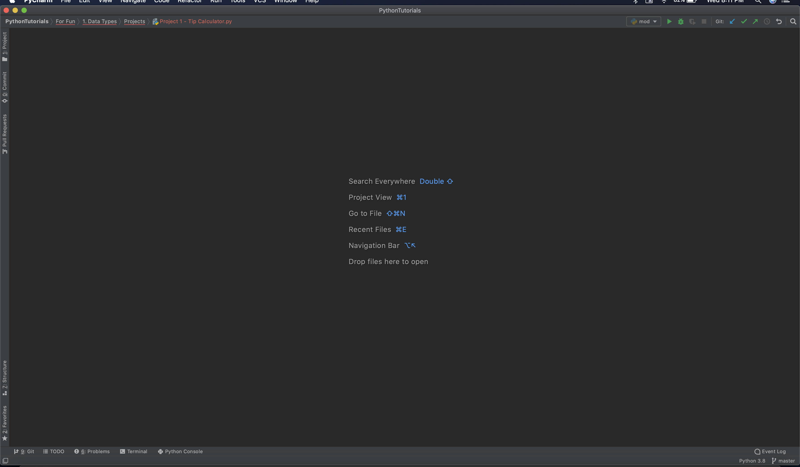
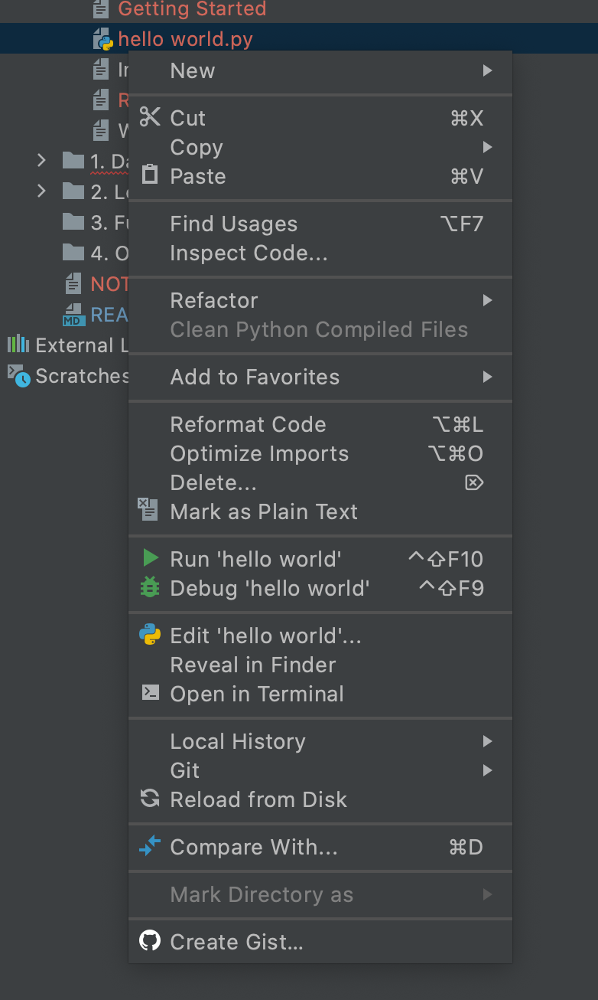
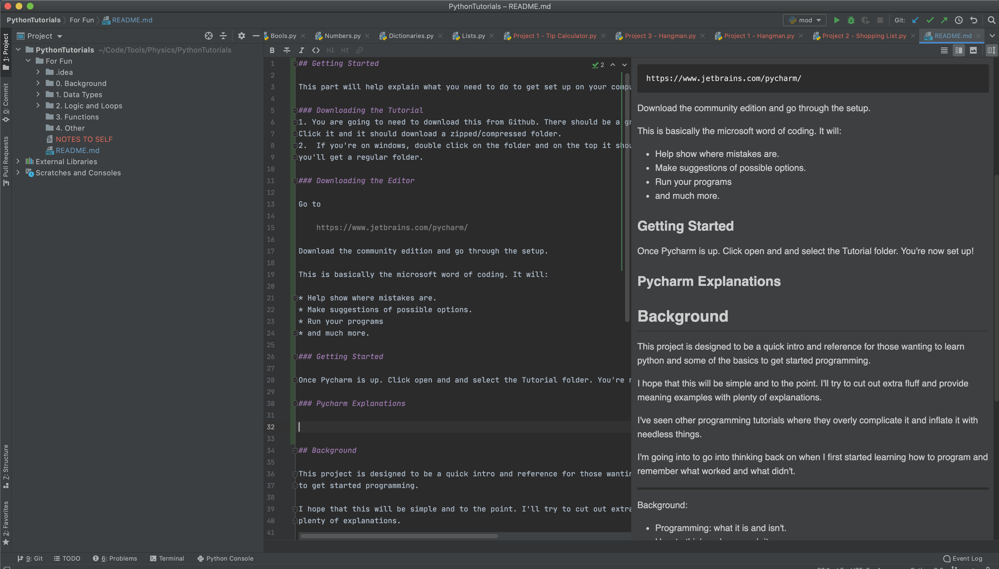

## Getting Started

This part will help explain what you need to do to get set up on your computer and start programming. 

### Downloading the Tutorial
1. You are going to need to download this from Github. There should be a green button which says "download or clone". 
Click it and it should download a zipped/compressed folder. 
2.  If you're on windows, double click on the folder and on the top it should say sometihing like "unzip". Click it and 
you'll get a regular folder.

### Downloading the Editor

Go to 
        
    https://www.jetbrains.com/pycharm/
    
Download the community edition and go through the setup.

This is basically the microsoft word of coding. It will:
    
* Help show where mistakes are.
* Make suggestions of possible options.
* Run your programs
* and much more.

### Getting Started

Once Pycharm is up. Click open and and select the Tutorial folder. You're now set up!

### Pycharm Explanations 

This should be the starting screen. You can see there's a tab of the far left side that says "project".
Click on that to see all of your files

When you right click on a python file (a file with the .py extension), this is what you'll see. 
One of the most important options of this is the 'run "Filename"' option with the green arrow. 
This is how you'll run a program. 

Most other options aren't important for now, but you may find some other ones useful later such as the debug option.

This is the general screen you'll see after you've gotten started. I want to point out that you can have 
multiple files open at the same time. These will show up at the top. If you want to switch to another open file, 
just click on the name of the file and it will switch over to it. 

## Background

This project is designed to be a quick intro and reference for those wanting to learn python and some of the basics 
to get started programming.

I hope that this will be simple and to the point. I'll try to cut out extra fluff and provide meaning examples with 
plenty of explanations. 

I've seen other programming tutorials where they overly complicate it and inflate it with needless things. 

I'm going into to go into thinking back on when I first started learning how to program and remember what worked and 
what didn't.

---
 Background:
* Programming: what it is and isn't.
* How to think and approach it
* Definitions
---
1. Data Types
    * Numbers and how to represent them - (ints, floats)
    * Using words, letters - (Strings and characters)
    * Collections
        * Ones that you can change and add to (Lists)
        * Unchangable ones (Tuples)
        * Key-Value pairs (Dictionaries)
2. Logic and Making the computer to all the work
    * Setting conditions (If statements)
    * repeating and doing things over and over
        * Knowing exactly how many times to repeat (for-loops)
        * Keep going until some unknown time (while loops)  
3. Functions
    * What are they and how they work
    * What they're used for. 
    * Best practices
4. Others things that are important

**Finally, please do not re-upload, sell, or distribute this tutorial without my permission. I claim all the rights to this content.**
